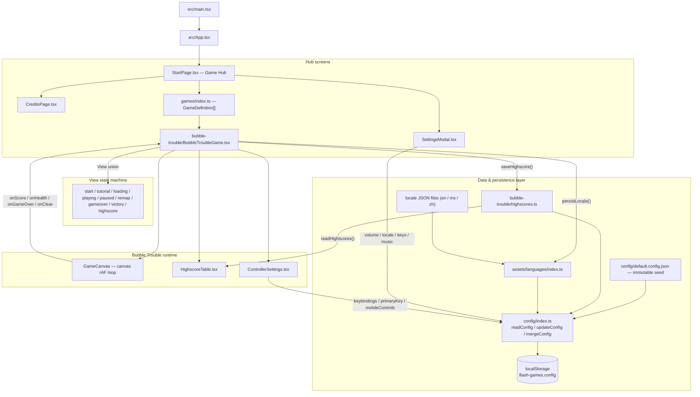
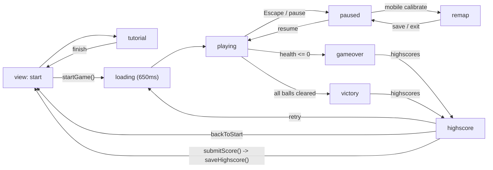

# Architecture Flow — Layers & Data Flow

> Client-side React + Vite app. No backend. All "database" I/O funnels through
> `src/config/index.ts`, which reads/writes the single `flash-games.config`
> document in `localStorage`. Static data (game registry, locale dictionaries)
> is bundled at build time.

## Architecture flowchart

## Game view state machine (ephemeral runtime flow)

## Persistence call sites

| Caller | Operation | Effect on `flash-games.config` |
|---|---|---|
| `SettingsModal.updateVolume` | `updateConfig(...)` | `settings.volume` |
| `StartPage.changeLocale` | `persistLocale()` → `updateConfig(...)` | `settings.locale` |
| `BubbleTroubleGame.toggleMusic` | `updateConfig(...)` | `settings.music` |
| `ControllerSettings` (remap/reset) | `updateConfig(...)` | `settings.primaryKey`, `settings.keybindings` |
| `BubbleTroubleGame.saveControllerAdjustment` | `updateConfig(...)` | `settings.mobileControls` |
| `highscores.saveHighscore` | `updateConfig(...)` | `highscores['bubble-trouble']` (top-10, desc) |