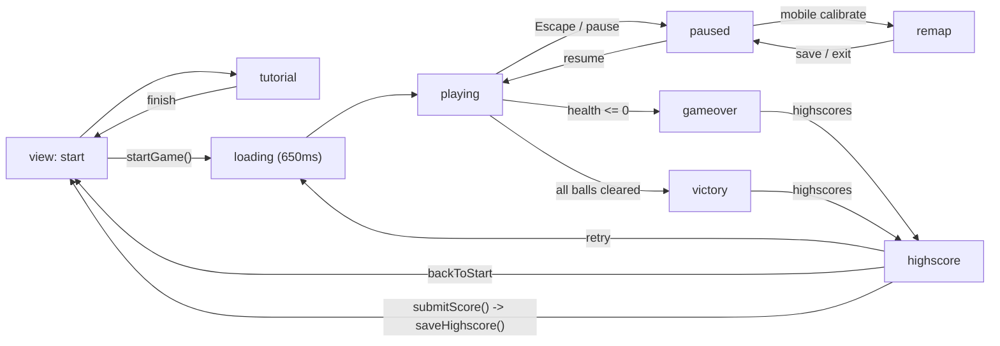
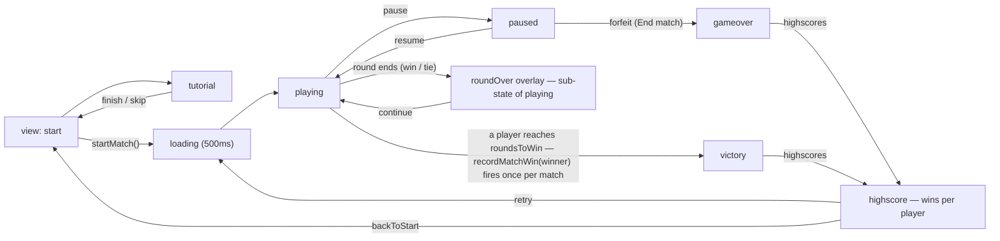
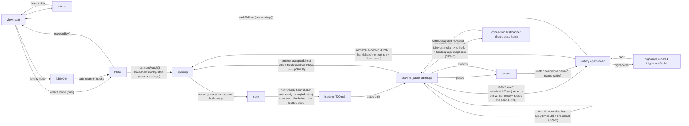
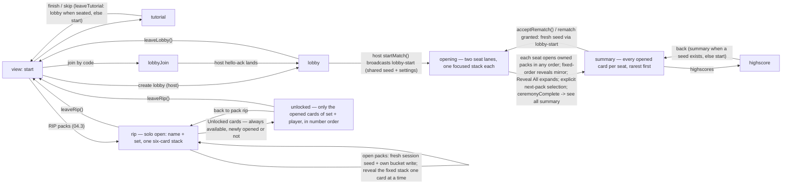

# Architecture Flow — Layers & Data Flow

> Client-side React + Vite app. No backend. All "database" I/O funnels through
> `src/config/index.ts`, which reads/writes the single `flash-games.config`
> document in `localStorage`. Static data (game registry, locale dictionaries,
> Pokemon set data) is bundled at build time. The one runtime external-data
> dependency besides PeerJS signaling is card artwork for the Pokemon game,
> hotlinked from the TCGdex CDN. A card face with artwork renders the artwork and
> nothing else, so no `cards.json` text is ever rendered and no card ever changes
> size. A face with no reachable artwork (the synthetic basic energies, which
> have no hosted art, or any failed/blocked/offline load) falls back to a
> data-free type tint of that same size printing the card's name and its
> translated rarity as text, so a missing image can never leave a blank,
> unlabelled tile. The face-down side has no hosted source at all, so it is the
> one raster asset bundled into the repo: `cardImage.ts` exports the `card-back.jpg`
> URL plus the `cardBackShowsArt(backUrl, failedUrl)` rule, and the same
> `PokemonCard` back face paints it full-bleed over the CSS gradient back, which
> stays both the loading face and the failed-load face.

## Architecture flowchart

```mermaid
flowchart TD
    main["src/main.tsx"] --> app["src/App.tsx"]
    main --> uiSounds["soundEffects.ts — UI & gameplay SFX (reads settings.sfx / muted / sfxVolume; skips silent prefix in pop buffer)"]
    app --> start["StartPage.tsx — Game Hub"]

    subgraph HUB["Hub screens"]
        start --> credits["CreditsPage.tsx"]
        start --> settingsModal["SettingsModal.tsx"]
        start --> registry["games/index.ts — GameDefinition[]"]
        registry --> bubble["bubble-trouble/BubbleTroubleGame.tsx"]
        registry --> tron["tron/TronGame.tsx"]
        registry --> pokemonBnb["pokemon-bnb/PokemonBnbGame.tsx"]
        registry --> packBattle["pokemon-pack-battle/PokemonPackBattleGame.tsx"]
    end

    subgraph GAME_LOOP["Bubble Trouble runtime"]
        bubble --> canvas["GameCanvas — canvas rAF loop"]
        canvas -->|"onScore / onHealth / onGameOver / onClear"| bubble
        canvas -->|"playBubblePop (pitch ↑ for smaller bubbles)"| uiSounds
        bubble --> hsTable["HighscoreTable.tsx (shared games/highscore)"]
        bubble --> ctrlSettings["ControllerSettings.tsx"]
    end

    subgraph TRON_LOOP["Tron runtime"]
        tron --> tronCanvas["TronGame canvas rAF loop (960x540, 100ms ticks)"]
        tronCanvas -->|"step() / bufferTurn() / continueAfterRound()"| core["tron/game-core.ts — pure grid / round / match logic"]
        core -->|"roundOver overlay (sub-state of playing)"| tron
        tron --> sticks["MobileSticks — two 2D analog sticks (movement = P1, shoot = P2; bot seats hide their stick)"]
        sticks -->|"absolute desired direction (never reverse) -> turnToward()"| core
        tron -->|"start-screen per-seat toggle: Player or Bot (easy / medium / hard)"| bots["tron/bots.ts — TurnSource / BotController / createBot()"]
        bots -->|"decide() per tick -> bufferTurn() before step()"| core
        tron --> tronHs["tron/highscores.ts"]
    end

    subgraph POKEMON["Pokemon TCG B&B mini runtime"]
        pokemonBnb -->|"hello / lobby-update / lobby-start with shared seed / opening-ready / deck-ready ids / leave"| peer["pokemon-bnb/net: peer.ts createHost / joinHost (PeerJS Cloud default or self-hosted server) + protocol.ts message envelope and LobbySettings"]
        peer -->|"onMessage handler (single stable closure via refs)"| pokemonBnb
        pokemonBnb -->|"openPacks(cards, pack, seed) — deterministic, identical pool on both seats"| data["pokemon-bnb data: sets.ts / cards.ts / rng.ts seeded xorshift32 / pack.ts / deck.ts legality"]
        pokemonBnb -->|"PokemonCard faces: cardImage.ts cardImageUrl(card) builds the TCGdex asset URL per card number (CP11); the hosted artwork IS the card face, at one uniform 8 by 11 size — when art paints the face no cards.json text is ever rendered and no card ever changes size. A face with no reachable art (synthetic basic energies; any failed, blocked or offline load) takes the text face (CP9): the same data-free type tint in the same 8 by 11 frame printing the card name plus the caller's translated rarity (CP11-E); every face-down card instead paints the bundled card back (CP10)"| cardArt["pokemon-bnb/cardImage.ts — hotlinks assets.tcgdex.net/en/me/30th/&lt;number&gt;/low.png at runtime; nothing downloaded or stored (set id to TCGdex path registry); synthetic basic energies have no art, so they always take the text face; the face-down back is the one bundled raster asset: cardImage.ts exports cardBackUrl plus the pure cardBackShowsArt rule, and PokemonCard.tsx paints it full-bleed over the gradient back, which stays the loading and failed-load face"]
        pokemonBnb -->|"deck-ready ids resolved against the shared pool -> setupBattle(settings, hostDeck, guestDeck, seed)"| engine["game-core/ module folder — index barrel re-exports<br/>constants / types / helpers / setup / actions / effects / turns / snapshots (pure, no React / DOM / network)"]
        engine -->|"BattleState -> tabletop render: turn header, side panels, translated log strip"| pokemonBnb
        pokemonBnb -->|"battle-action intent (guest) -> host processAction -> battle-snapshot per seat -> applySnapshot (CP9-B)"| sync["Host-authoritative sync: battleRef = live engine state (host), battle = render snapshot; the guest is view-only"]
        sync -->|"turn timer: derived secondsLeft per turn key, host applyTimeout on expiry + broadcast (CP9-C)"| engine
        pokemonBnb -->|"disconnect: joinHost redial + re-hello -> host replays per-seat snapshots (CP9-D); rematch offer -> host startPackOpening() fresh seed (CP9-E)"| peer
    end

    subgraph PACKBATTLE["Pokemon Pack Battle runtime"]
        packBattle -->|"hello / lobby-update / lobby-start with shared seed / pack-open / card-reveal / pack-reveal-all / ceremony-sync / battle-done / leave"| packPeer["pokemon-pack-battle/net: protocol.ts fork (version 3; 1-36 packs total, 6 cards/pack, free-order own-pack opening) + bnb-style PeerJS host/guest sessions"]
        packPeer -->|"onMessage handler (single stable closure via refs; same-seed re-hello merges ceremony-sync)"| packBattle
        packBattle -->|"shared seed -> identical deterministic 6-card battle packs (energy, common, common, pikachu-ir, common-or-better, uncommon-or-better)"| packData["battlePack.ts PACK_BATTLE_30C + scoring.ts tier/points + shared 30c set data"]
        packBattle -->|"per-pack session state: opened, six revealed flags, expanded; host/guest focus independently by owned pack; totals derive from revealed flags"| packCeremony["ceremonyState.ts — pure v3 transitions, ownership checks, fixed-order reveal, union merge, totals, completion, focused-pack and key resolvers"]
        packBattle -->|"two simultaneous seat lanes: one focused PackStack each; normal mode exposes one action target and leaves the latest revealed card on top; pack-reveal-all expands all six for review; completed stack waits for explicit next owned pack"| packStack["PackStack.tsx / PackStack.css — shared stack and PokemonCard flip presentation"]
        packBattle -->|"pointsForCard per revealed slot by card identity; Pikachu IR scores 0; tier-0..5 flair; packs-left and card-N-of-6 progress"| packData
        packBattle -->|"solo rip (04.3): openBattlePacks(battleSetCards(), PACK_BATTLE_30C, count, fresh session-only seed) — the same 6-slot distribution, no wire; PackStack renders the fixed seeded reveal and expanded review"| packData
    end

    subgraph STATE["View state machine"]
        bubble -->|"View union"| views["start / tutorial / loading / playing / paused / remap / gameover / victory / highscore"]
        tron -->|"View union"| tronViews["start / tutorial / loading / playing / paused / gameover / victory / highscore (round-over is an overlay sub-state of playing; stick remap is an in-pause overlay, not a view)"]
        pokemonBnb -->|"View union"| pkmViews["start / tutorial / lobby / lobbyJoin / opening / deck / loading / playing / paused / gameover / victory / highscore (battle tabletop renders from playing; paused solid since CP8; results solid since CP10 — settleMatchOver routes the winning seat to victory, the losing seat to gameover, and highscore is reachable from both results views)"]
        packBattle -->|"View union"| packViews["start / tutorial / lobby / lobbyJoin / opening / summary / highscore (opening has two simultaneous seat lanes; each seat focuses one owned PackStack and chooses the next owned pack explicitly after completion; no shared round cursor; summary is gated until every pack is opened and all six cards are revealed)"]
        packBattle -->|"View union (04.3)"| packRipViews["rip / unlocked — solo pack rips + unlocked collection: start -> rip -> unlocked -> rip -> start, both leaving to start; rip rolls a fresh session-only seed per open and writes the pulled ids to the openedCards bucket, unlocked shows every card of the chosen set in card-number order with the cards the chosen player has not opened yet greyscaled and darkened (locked, never hidden), and is reachable from the rip form without opening a pack"]
    end

    subgraph PERSIST["Data & persistence layer"]
        cfg["config/index.ts<br/>readConfig / updateConfig / mergeConfig"]
        defaults["config/default.config.json — immutable seed"]
        highscores["bubble-trouble/highscores.ts"]
        tronHs["tron/highscores.ts"]
        pkmHs["pokemon-bnb/highscores.ts"]
        packHs["pokemon-pack-battle/highscores.ts"]
        packCards["pokemon-pack-battle/collection.ts — openedCards helpers"]
        l10n["assets/languages/index.ts"]
        defaults --> cfg
        highscores --> cfg
        tronHs --> cfg
        pkmHs --> cfg
        packHs --> cfg
        packCards --> cfg
        l10n --> cfg
        settingsModal -->|"audio (music / sfx / mute) / locale / keys"| cfg
        uiSounds -.->|"readConfig() — settings.sfx / muted / sfxVolume"| cfg
        ctrlSettings -->|"keybindings / primaryKey / mobileControls"| cfg
        bubble -->|"persistLocale()"| l10n
        bubble -->|"saveHighscore()"| highscores
        highscores -->|"readHighscores()"| hsTable
        tron -->|"persistLocale()"| l10n
        tron -->|"recordMatchWin() on match end"| tronHs
        tronHs -->|"readHighscores()"| tron
        pokemonBnb -->|"recordMatchWin() once per match (settleMatchOver)"| pkmHs
        pkmHs -->|"readHighscores()"| pokemonBnb
        packBattle -->|"recordPackBattleWin() once per battle"| packHs
        packHs -->|"readPackBattleHighscores()"| packBattle
        packBattle -->|"persistLocale()"| l10n
        packBattle -->|"recordOpenedCards(displayName, own-seat pack ids) once per ceremony, and per solo rip (04.3); per-pack ceremony flags remain session-only (04.2)"| packCards
        packCards -->|"readOpenedCards / listPlayers / hasCard — rip + unlocked pages"| packBattle
        l10nD["locale JSON files (en / ms / zh)"] --> l10n
        cfg --> ls[("localStorage<br/>flash-games.config")]
    end
```

## Game view state machine (ephemeral runtime flow)

## Tron view state machine (ephemeral runtime flow)

The round-over banner is an **overlay sub-state of `playing`**, not a separate
view; stick remapping happens inside the pause overlay (Save controller /
Exit without saving), also not a separate view.

> The Tron highscore view is read-only: the winner's win is recorded
> automatically on entry to `victory` (once per match, under the winner's
> display name set on the start screen). Forfeits, tied rounds, and wins by a
> bot seat record nothing.

## Pokemon B&B mini view state machine (ephemeral runtime flow)

`paused` is a solid state-machine transition (CP8): `playing` renders the
battle tabletop under the pause overlay (resume/leave), and since CP9 the
wall-clock countdown freezes there instead of resetting (elapsed time is kept
per turn key and the remaining seconds are derived during render). Since CP9 the
match is host-authoritative: the host keeps the live `BattleState` in
`battleRef` and both seats render `applySnapshot(toSnapshot(state, seat))` from
per-seat `battle-snapshot` frames, while a guest turn is a `battle-action`
intent that only the host validates with `processAction` — so a guest can never
inject state. Timer expiry runs `applyTimeout` on the host and is broadcast; a
dropped data channel keeps the battle intact (connection-lost banner) while
`joinHost` auto-redials and a re-`hello` makes the host replay its snapshots; a
finished match can be replayed through the `rematch` offer, which the host
grants by rolling a fresh seed through the normal `lobby-start` handshake (both
seats return to `opening`). Since CP10 the results are solid transitions: when
`battle.over` first becomes true on a seat, `settleMatchOver()` records the
winner once per device via `pokemon-bnb/highscores.recordMatchWin` and routes
the seat to `victory` (it won, or any winner in the `?local=1` hot-seat) or
`gameover`; from there both seats can offer/accept a rematch, the host can
retry (fresh seed → `opening`), open the shared `highscore` table (which
returns with `back`), or leave to `start`. Confirm/Skip keys (remappable as
`pokemon-confirm` / `pokemon-skip` in settings) advance the reveal, skip it,
submit the deck, and confirm the promotion gate. The battle tabletop renders
from `playing` once both `deck-ready` handshakes have run `beginBattle()`.
`leaveLobby()` returns to `start` from every view.

## Pokemon Pack Battle view state machine (ephemeral runtime flow)

The pack-battle ceremony is wholly shared and deterministic: the host rolls the
seed in `lobby-start` and both seats derive identical packs from
`battlePack.ts`. Each seat opens only its owned packs in any order, while every
`pack-open`, `card-reveal`, and `pack-reveal-all` action is mirrored to both
screens. `ceremonyState.ts` stores session-only per-pack `opened`, six-slot
`revealed`, and `expanded` flags. The opening view renders two simultaneous
seat lanes, one focused `PackStack` per seat, with compact owned-pack
selectors; normal stack mode exposes one action target and leaves the latest
revealed card on top, while Reveal All expands all six cards for review. A
completed stack remains visible until its owner explicitly selects another
owned pack. Confirm/Skip are remappable (`pokemon-pack-confirm` /
`pokemon-pack-skip`) reveal-only actions; Skip deterministically wins if both
bindings share a key. The same-seed `lobby-start` plus host `ceremony-sync`
replay restores opened, revealed, and expanded state after a re-hello, and a
seeded-match channel drop preserves the ceremony while the guest redials. Since
04.3 the same component also hosts two solo views that never touch the wire:
`rip` rolls a fresh session-only seed and opens one pack from the same 30C
definition, writes the pulled ids to the persisted `openedCards` bucket under
the entered player name, and uses the same `PackStack` presentation. The RIP
form's secondary button opens the collection directly, so previously unlocked
cards are viewable without ripping anything in this session; `unlocked` shows
the whole set in card-number order and greyscales plus darkens every card that
player has not opened yet. On ceremony completion this device records the
local seat's own packs exactly once (`cardIdsForSeat`: host = even-indexed
packs, guest = odd-indexed, an odd tail pack belongs to both seats) together
with a transient `packBattle.collectionSaved` notice, so the opponent's packs
never enter this device's collection; `resetCeremony` re-arms that one-shot
guard so a rematch records its own packs too. `leaveLobby()` and `leaveRip()`
return to `start` from every view, and `highscore` returns to `summary` when a
match seed exists, else to `start`.

## Persistence call sites

| Caller | Operation | Effect on `flash-games.config` |
|---|---|---|
| `SettingsModal.updateAudio` | `updateConfig(...)` | `settings.music`, `settings.musicVolume`, `settings.sfx`, `settings.sfxVolume`, `settings.muted` |
| `StartPage.changeLocale` | `persistLocale()` → `updateConfig(...)` | `settings.locale` |
| `ControllerSettings` (remap/reset) | `updateConfig(...)` | `settings.primaryKey`, `settings.keybindings` |
| `BubbleTroubleGame.saveControllerAdjustment` | `updateConfig(...)` | `settings.mobileControls` |
| `highscores.saveHighscore` | `updateConfig(...)` | `highscores['bubble-trouble']` (top-10, desc) |
| `TronGame.changeLocale` | `persistLocale()` → `updateConfig(...)` | `settings.locale` |
| `TronGame.saveControllerAdjustment` | `updateConfig(...)` | `settings.mobileControls` |
| `tron/highscores.recordMatchWin` (TronGame victory effect) | `updateConfig(...)` | `highscores['tron']` (per-player match-win tally, top-10 by wins) |
| `pokemon-bnb/highscores.recordMatchWin` (PokemonBnbGame `settleMatchOver`, once per match per device) | `updateConfig(...)` | `highscores['pokemon-bnb']` (per-player match-win tally, top-10 by wins) |
| `pokemon-pack-battle/collection.recordOpenedCards` (PokemonPackBattleGame ceremony-complete effect, once per ceremony per device) | `updateConfig(...)` | `openedCards[lowercased player name]` ← union + dedupe + sort of the local seat's **own** pack ids (`cardIdsForSeat`: host = even packs, guest = odd packs, an odd tail pack counts to both); the opponent's packs are never written (04.3) |
| `pokemon-pack-battle/collection.recordOpenedCards` (PokemonPackRip `handleOpenPacks`, one call per solo rip) | `updateConfig(...)` | `openedCards[lowercased player name]` ← union + dedupe + sort of that rip's pulled ids (same helper, same bucket; re-pulling a card never duplicates it) (04.3) |
| `pokemon-pack-battle/collection.readOpenedCards / listPlayers / hasCard` (PokemonPackRip unlocked page, read during render) | `readConfig()` | read-only: the player keys and each player's sorted opened card ids — the page has no storage subscription, so it re-reads rather than caching (04.3) |

### Config change subscriptions

`updateConfig` notifies subscribers registered via `subscribeConfig` (same-call-site table above still applies — subscriptions only read):

| Subscriber | Reaction |
|---|---|
| `start/startPageMusic.ts` (`useStartPageMusic`) | Re-applies `settings.musicVolume` and starts/stops the looping start-page track “Alien no.1” from `settings.music` + `settings.muted`; pauses while a game page is open |