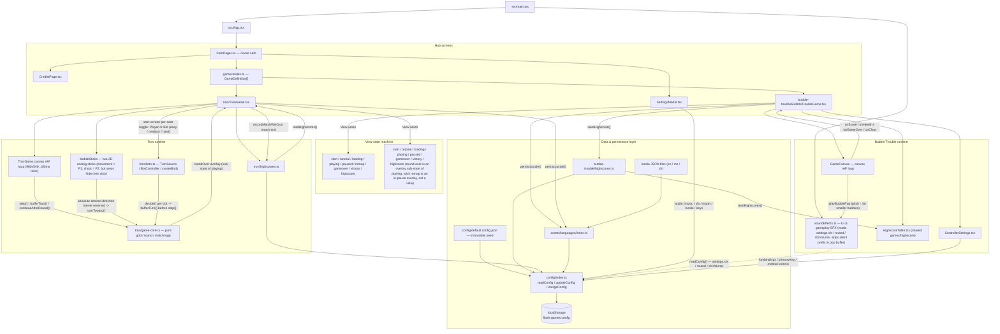
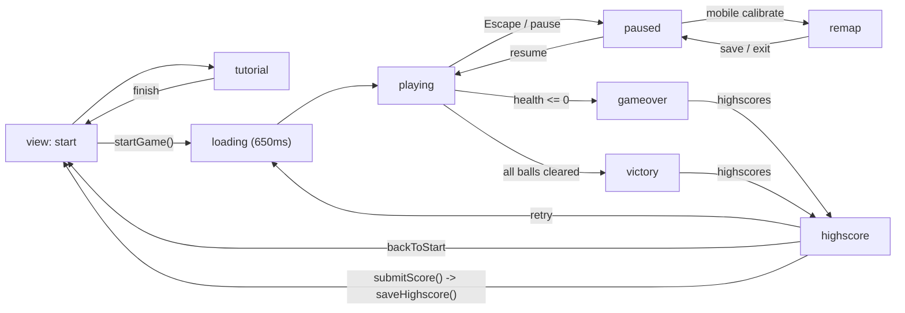
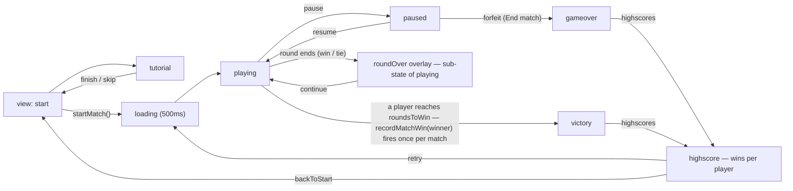

# Architecture Flow — Layers & Data Flow

> Client-side React + Vite app. No backend. All "database" I/O funnels through
> `src/config/index.ts`, which reads/writes the single `flash-games.config`
> document in `localStorage`. Static data (game registry, locale dictionaries)
> is bundled at build time.

## Architecture flowchart

## Game view state machine (ephemeral runtime flow)

## Tron view state machine (ephemeral runtime flow)

The round-over banner is an **overlay sub-state of `playing`**, not a separate
view; stick remapping happens inside the pause overlay (Save controller /
Exit without saving), also not a separate view.

> The Tron highscore view is read-only: the winner's win is recorded
> automatically on entry to `victory` (once per match, under the winner's
> display name set on the start screen). Forfeits, tied rounds, and wins by a
> bot seat record nothing.

## Persistence call sites

| Caller | Operation | Effect on `flash-games.config` |
|---|---|---|
| `SettingsModal.updateAudio` | `updateConfig(...)` | `settings.music`, `settings.musicVolume`, `settings.sfx`, `settings.sfxVolume`, `settings.muted` |
| `StartPage.changeLocale` | `persistLocale()` → `updateConfig(...)` | `settings.locale` |
| `ControllerSettings` (remap/reset) | `updateConfig(...)` | `settings.primaryKey`, `settings.keybindings` |
| `BubbleTroubleGame.saveControllerAdjustment` | `updateConfig(...)` | `settings.mobileControls` |
| `highscores.saveHighscore` | `updateConfig(...)` | `highscores['bubble-trouble']` (top-10, desc) |
| `TronGame.changeLocale` | `persistLocale()` → `updateConfig(...)` | `settings.locale` |
| `TronGame.saveControllerAdjustment` | `updateConfig(...)` | `settings.mobileControls` |
| `tron/highscores.recordMatchWin` (TronGame victory effect) | `updateConfig(...)` | `highscores['tron']` (per-player match-win tally, top-10 by wins) |

### Config change subscriptions

`updateConfig` notifies subscribers registered via `subscribeConfig` (same-call-site table above still applies — subscriptions only read):

| Subscriber | Reaction |
|---|---|
| `start/startPageMusic.ts` (`useStartPageMusic`) | Re-applies `settings.musicVolume` and starts/stops the looping start-page track “Alien no.1” from `settings.music` + `settings.muted`; pauses while a game page is open |