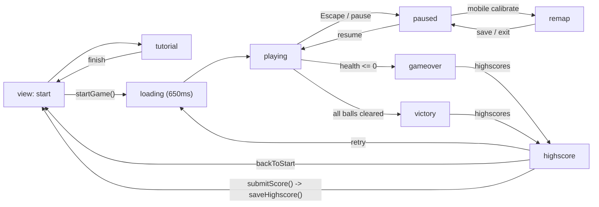
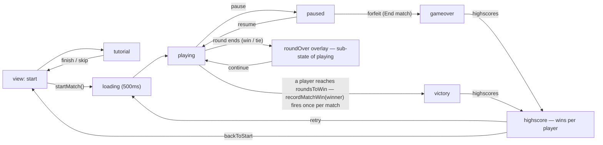
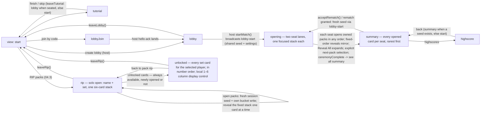

# Architecture Flow — Layers & Data Flow

> Client-side React + Vite app. No backend. All "database" I/O funnels through
> `src/config/index.ts`, which reads/writes the single `flash-games.config`
> document in `localStorage`. Static data (game registry, locale dictionaries,
> Pokemon set data) is bundled at build time. The one runtime external-data
> dependency besides PeerJS signaling is card artwork for the Pokemon game,
> hotlinked from the TCGdex CDN. A card face with artwork renders the artwork and
> nothing else, so no `cards.json` text is ever rendered and no card ever changes
> size. A face with no reachable artwork (the synthetic basic energies, which
> have no hosted art, or any failed/blocked/offline load) falls back to a
> data-free type tint of that same size printing the card's name and its
> translated rarity as text, so a missing image can never leave a blank,
> unlabelled tile. The face-down side has no hosted source at all, so it is the
> one raster asset bundled into the repo: `cardImage.ts` exports the `card-back.jpg`
> URL plus the `cardBackShowsArt(backUrl, failedUrl)` rule, and the same
> `PokemonCard` back face paints it full-bleed over the CSS gradient back, which
> stays both the loading face and the failed-load face.

## Architecture flowchart

```mermaid
flowchart TD
    main["src/main.tsx"] --> app["src/App.tsx"]
    main --> uiSounds["soundEffects.ts — UI & gameplay SFX (reads settings.sfx / muted / sfxVolume; skips silent prefix in pop buffer)"]
    app --> start["StartPage.tsx — Game Hub"]

    subgraph HUB["Hub screens"]
        start --> credits["CreditsPage.tsx"]
        start --> settingsModal["SettingsModal.tsx"]
        start --> registry["games/index.ts — GameDefinition[]"]
        registry --> bubble["bubble-trouble/BubbleTroubleGame.tsx"]
        registry --> tron["tron/TronGame.tsx"]
        registry --> pokemonBnb["pokemon-bnb/PokemonBnbGame.tsx"]
        registry --> packBattle["pokemon-pack-battle/PokemonPackBattleGame.tsx"]
    end

    subgraph GAME_LOOP["Bubble Trouble runtime"]
        bubble --> canvas["GameCanvas — canvas rAF loop"]
        canvas -->|"onScore / onHealth / onGameOver / onClear"| bubble
        canvas -->|"playBubblePop (pitch ↑ for smaller bubbles)"| uiSounds
        bubble --> hsTable["HighscoreTable.tsx (shared games/highscore)"]
        bubble --> ctrlSettings["ControllerSettings.tsx"]
    end

    subgraph TRON_LOOP["Tron runtime"]
        tron --> tronCanvas["TronGame canvas rAF loop (960x540, 100ms ticks)"]
        tronCanvas -->|"step() / bufferTurn() / continueAfterRound()"| core["tron/game-core.ts — pure grid / round / match logic"]
        core -->|"roundOver overlay (sub-state of playing)"| tron
        tron --> sticks["MobileSticks — two 2D analog sticks (movement = P1, shoot = P2; bot seats hide their stick)"]
        sticks -->|"absolute desired direction (never reverse) -> turnToward()"| core
        tron -->|"start-screen per-seat toggle: Player or Bot (easy / medium / hard)"| bots["tron/bots.ts — TurnSource / BotController / createBot()"]
        bots -->|"decide() per tick -> bufferTurn() before step()"| core
        tron --> tronHs["tron/highscores.ts"]
    end

    subgraph POKEMON["Pokemon TCG B&B mini runtime"]
        pokemonBnb -->|"hello / lobby-update / lobby-start with shared seed / opening-ready / deck-ready ids / leave"| peer["pokemon-bnb/net: peer.ts createHost / joinHost (PeerJS Cloud default or self-hosted server) + protocol.ts message envelope and LobbySettings. PROTOCOL_VERSION 2 (03.2 CP1): a version-1 peer is refused because it cannot safely share the revised rules. LobbySettings.prizeCards is exactly 4 or 6 (default 4); deck-ready accepts exactly 40 ids"]
        peer -->|"onMessage handler (single stable closure via refs)"| pokemonBnb
        pokemonBnb -->|"openPacks(cards, pack, seatSeed(seed, seat)) — deterministic PER-SEAT pool: each player opens their own packs, and both peers derive BOTH streams from the single broadcast lobby seed (no new protocol field, no card data on the wire); each seat's deck resolves against its OWN pool"| data["pokemon-bnb data: sets.ts / cards.ts / rng.ts seeded xorshift32 / pack.ts (seatSeed) / deck.ts legality. 03.2 CP2: a deck is exactly 40 cards including Energy; non-Energy cards are copy-limited by that seat's opened pool while Energy comes from an unlimited 8-type basic catalog serialized in fixed order. 03.2 CP1: Prize cards are NOT part of the 40 — setup takes 4 or 6 from that same deck. 04.6: the card model carries the printed rule box as an optional `suffix` (e.g. EX), mapped from the TCGdex `suffix` field because the API exposes NO ruleBox field and the local pipeline had been dropping it; it is stored as the raw upstream string, not a closed union"]
        pokemonBnb -->|"PokemonCard faces: cardImage.ts cardImageUrl(card) builds the TCGdex asset URL per card number (CP11); the hosted artwork IS the card face, at one uniform 8 by 11 size — when art paints the face no cards.json text is ever rendered and no card ever changes size. A face with no reachable art (synthetic basic energies; any failed, blocked or offline load) takes the text face (CP9): the same data-free type tint in the same 8 by 11 frame printing the card name plus the caller's translated rarity (CP11-E); every face-down card instead paints the bundled card back (CP10)"| cardArt["pokemon-bnb/cardImage.ts — hotlinks assets.tcgdex.net/en/me/30th/&lt;number&gt;/low.png at runtime; nothing downloaded or stored (set id to TCGdex path registry); synthetic basic energies have no art, so they always take the text face; the face-down back is the one bundled raster asset: cardImage.ts exports cardBackUrl plus the pure cardBackShowsArt rule, and PokemonCard.tsx paints it full-bleed over the gradient back, which stays the loading and failed-load face"]
        pokemonBnb -->|"deck-ready ids resolved against the shared pool -> setupBattle(settings, hostDeck, guestDeck, seed)"| engine["game-core/ module folder — index barrel re-exports<br/>constants / types / helpers / setup / actions / effects / turns / snapshots (pure, no React / DOM / network)<br/>03.2: explicit setup (seeded coin flip, private 7-card hand, Mulligan + opponent penalty, Active/Bench, simultaneous reveal); turn phases draw -> main -> attack/pass -> between; 04.5: an attack is DECLARED straight from the main phase (checkAttackDeclaration accepts main OR attack, and the engine enters the Attack step itself before resolving) while beginAttack stays the explicit step button — before 04.5 every UI route was a dead end, because the per-attack buttons sent useAttack while the engine demanded the step, and pressing Attack then disabled every attack; damage stays RAW points and DAMAGE_PER_COUNTER = 10 is the single display conversion (damageCounters / hpCounters / remainingCounters), with isKnockedOut still comparing raw damage to raw hp so no display change can alter a result; toSnapshot reports the real prizesTaken and applySnapshot sizes the hidden pile from prizeCount alone — two bugs used to cancel out there; 03.2 CP5 deterministic Ability registry (classifyAbility / applyAbilityEffect / abilityCoverageReport — unsupported Ability text is reported, never guessed); 04.6: a knockout takes prizesForKnockOut(card) Prize cards — 1 for an ordinary Pokemon, 2 for an EX rule box — read from that `suffix`, never from the card NAME, and bounded by what is left in the pile, so an ex knocked out with one prize left takes that one and wins; performKo breaks out of the take loop rather than returning so the rule-box log line is still emitted for the knockout that ENDS the match, and {count} reports what was actually taken. The 3-prize Mega ex rule is deliberately NOT implemented: no Mega ex card exists in the API, so the branch would be unreachable and its suffix spelling unverifiable; 04.7: eleven more effect families that are pure damage maths over board state already held (per attached Energy type, per damage counter, if it has an Energy type, per own Pokemon in play or by card name, per distinct Energy type, per Energy in the discard pile, per Energy attached to the defender, if the defender carries an EX rule box, flip-until-tails damage, a typed Energy discard) plus an extra Prize card on a knockout — covering 16 of the 85 attack texts that previously reported unsupported; MEASURED after 04.8 CP3-B: 41 of 99 distinct attack texts parse completely and 58 still report a clause as unsupported, and those 58 are deliberately reported rather than guessed because they need a multi-card pick, new per-turn state, or board manipulation, none of which a pure synchronous engine can express. 04.8 made the choice expressible: a clause that hands the target to the player parks a PendingChoice instead of applying anything, processAction refuses every other action while it is open (promotion is checked FIRST, since a Knock Out is a hard game-state requirement), and resolveChoice applies it by target UID — never by Bench index, because a promotion outranks a choice and splices the Bench out from under a stored index. A deck search is the one variant keyed on a DECK INDEX plus a re-checked card id, since a Deck may hold duplicates. The turn is held OPEN until the pick lands, and a search that matches nothing parks NO choice — a failed search is a legal turn-ending no-op, never a soft-lock<br/>04.12 CP8: trainers.ts adds parseTrainerEffects (accent-folded, anchored, strict all-or-nothing because a Trainer that half-resolves is a wrong game state) plus trainerClauseSupport and trainerCoverageReport, so the Trainer category is MEASURED rather than reported as unmeasured. recognised and implemented are TWO numbers, never one: a parser can cover the whole set while the engine still plays no Trainer. An empty effect string is reported as a DATA gap, never as an engine gap, and a clause kind with no entry in CLAUSE_SUPPORT reports unstated rather than defaulting"]
        engine -->|"BattleState -> tabletop render: turn header, side panels, translated log strip"| pokemonBnb
        pokemonBnb -->|"BattleBoard.tsx (03.2 CP6): ONE BattleSide component renders both seats; the opponent lane is mirrored with flex column-reverse (never a transform, which would invert the translated labels). Shared Stadium + Active + Bench (5) + Prize + Deck + Discard + Hand; Energy/Tool attachments as chips; 04.5: PokemonVitals.tsx + PokemonVitals.css render the health and damage-counter readout beside every in-play card — HP in the card's own points, then damage in counters (1 counter = 10 damage), then the remainder — on the Active and every Bench slot of BOTH lanes, reused by the CardFocus overlay; an undamaged Pokemon shows health alone; PokemonCard's damage badge also reads in counters, not raw points; a hidden zone arrives as HIDDEN_CARD and only ever prints its count. 04.6: attached Energy is grouped by the TYPE it provides, one chip per type carrying that type's count, ordered by the canonical BASIC_ENERGY_TYPES, because attacks are costed in Energy types and a bare total cannot answer can I pay for this; special Energy (no provides) gets its own chip, and the total chip is kept alongside. The swatch is aria-hidden decoration and the chip carries the whole accessible name, so colour is never the only channel. The Attachments component is exported and reused by the CardFocus overlay rather than reimplemented"| render["03.2 CP7 controls.ts: controlStates() is the single source of truth for enabled + reason, so a disabled control always says why. 04.5: attackControl() = the shared useAttack rule (legal in the main phase AND the attack step) plus that one attack's own Energy cost, so two attacks on a card can differ and each button reports its OWN reason; focus.ts offers attacks from the same answer and the focus handler declares with a single useAttack intent. CP8: the opening view uses the shared src/games/cardstack/PackStack (extracted from Pack Battle, generalized to plain CardDef[]) — one transparent action target, latest revealed card exposed, Reveal All expands, no auto-advance"]
        pokemonBnb -->|"battle-action intent (guest) -> host processAction -> battle-snapshot per seat -> applySnapshot (CP9-B)"| sync["Host-authoritative sync: battleRef = live engine state (host), battle = render snapshot; the guest is view-only. Snapshot privacy: a seat's frame carries REAL cards for its OWN hand and (04.8 CP3) its OWN deck, and HIDDEN_CARD placeholders plus a bare count for the OPPONENT's hand, deck and prize pile — so the invariant is per-frame, and a seat never receives the other seat's deck. Prizes carry no array at all, only prizesTaken/prizeCount. A rebuilt state is viewOnly, so it can never be acted on even though it now holds real deck cards, and the disclosed deck is deep-cloned so a render-side mutation cannot reach the authoritative one. toSnapshot -> applySnapshot -> toSnapshot stays byte-identical, which is what makes a re-hello replay safe"]
        sync -->|"turn timer: derived secondsLeft per turn key, host applyTimeout on expiry + broadcast (CP9-C)"| engine
        pokemonBnb -->|"disconnect: joinHost redial + re-hello -> host replays per-seat snapshots (CP9-D); rematch offer -> host startPackOpening() fresh seed (CP9-E)"| peer
        engine -->|"Between-Turns: Poison -> Burn -> Asleep -> Paralysis, then an ordered simultaneous-KO promotion queue with the next player promoting first (03.2 CP4); a pending KO blocks every unrelated action (CP7)"| engine
    end

    subgraph PACKBATTLE["Pokemon Pack Battle runtime"]
        packBattle -->|"hello / lobby-update / lobby-start with shared seed / pack-open / card-reveal / pack-reveal-all / ceremony-sync / battle-done / leave"| packPeer["pokemon-pack-battle/net: protocol.ts fork (version 3; 1-36 packs total, 6 cards/pack, free-order own-pack opening) + bnb-style PeerJS host/guest sessions"]
        packPeer -->|"onMessage handler (single stable closure via refs; same-seed re-hello merges ceremony-sync)"| packBattle
        packBattle -->|"shared seed -> identical deterministic 6-card battle packs (energy, common, common, pikachu-ir, common-or-better, uncommon-or-better)"| packData["battlePack.ts PACK_BATTLE_30C + scoring.ts tier/points + shared 30c set data"]
        packBattle -->|"per-pack session state: opened, six revealed flags, expanded; host/guest focus independently by owned pack; totals derive from revealed flags"| packCeremony["ceremonyState.ts — pure v3 transitions, ownership checks, fixed-order reveal, union merge, totals, completion, focused-pack and key resolvers"]
        packBattle -->|"two simultaneous seat lanes: one focused PackStack each; normal mode exposes one action target and leaves the latest revealed card on top; pack-reveal-all expands all six for review; completed stack waits for explicit next owned pack"| packStack["src/games/cardstack/PackStack.tsx / PackStack.css — SHARED stack and PokemonCard flip presentation (03.2 CP8 extracted it here and generalized it to plain CardDef[] so pokemon-bnb renders the same reveal; classes renamed ppb-pack-stack* -> pkcs-stack*)"]
        packBattle -->|"pointsForCard per revealed slot by card identity; Pikachu IR scores 0; tier-0..7 flair (CR 3, IR 2, SIR 5, FR 7); packs-left and card-N-of-6 progress"| packData
        packBattle -->|"solo rip (04.3): openBattlePacks(battleSetCards(), PACK_BATTLE_30C, count, fresh session-only seed) — the same 6-slot distribution (the uncommon-or-better slot is the sole roll for 'classic rare' 159-188, weighted 11 of 110 = 1 in 10 packs, 3 pts), no wire; PackStack renders the fixed seeded reveal and expanded review"| packData
    end

    subgraph STATE["View state machine"]
        bubble -->|"View union"| views["start / tutorial / loading / playing / paused / remap / gameover / victory / highscore"]
        tron -->|"View union"| tronViews["start / tutorial / loading / playing / paused / gameover / victory / highscore (round-over is an overlay sub-state of playing; stick remap is an in-pause overlay, not a view)"]
        pokemonBnb -->|"View union"| pkmViews["start / tutorial / lobby / lobbyJoin / opening / deck / loading / playing / paused / gameover / victory / highscore (battle tabletop renders from playing; paused solid since CP8; results solid since CP10 — settleMatchOver routes the winning seat to victory, the losing seat to gameover, and highscore is reachable from both results views)"]
        packBattle -->|"View union"| packViews["start / tutorial / lobby / lobbyJoin / opening / summary / highscore (opening has two simultaneous seat lanes; each seat focuses one owned PackStack and chooses the next owned pack explicitly after completion; no shared round cursor; summary is gated until every pack is opened and all six cards are revealed)"]
        packBattle -->|"View union (04.3)"| packRipViews["rip / unlocked — solo pack rips + unlocked collection: start -> rip -> unlocked -> rip -> start, both leaving to start; rip rolls a fresh session-only seed per open and writes the pulled ids to the openedCards bucket, unlocked shows every card of the chosen set in card-number order with the cards the chosen player has not opened yet greyscaled and darkened (locked, never hidden), and is reachable from the rip form without opening a pack"]
    end

    subgraph PERSIST["Data & persistence layer"]
        cfg["config/index.ts<br/>readConfig / updateConfig / mergeConfig"]
        defaults["config/default.config.json — immutable seed"]
        highscores["bubble-trouble/highscores.ts"]
        tronHs["tron/highscores.ts"]
        pkmHs["pokemon-bnb/highscores.ts"]
        packHs["pokemon-pack-battle/highscores.ts"]
        packCards["pokemon-pack-battle/collection.ts — openedCards helpers"]
        l10n["assets/languages/index.ts"]
        defaults --> cfg
        highscores --> cfg
        tronHs --> cfg
        pkmHs --> cfg
        packHs --> cfg
        packCards --> cfg
        l10n --> cfg
        settingsModal -->|"audio (music / sfx / mute) / locale / keys"| cfg
        uiSounds -.->|"readConfig() — settings.sfx / muted / sfxVolume"| cfg
        ctrlSettings -->|"keybindings / primaryKey / mobileControls"| cfg
        bubble -->|"persistLocale()"| l10n
        bubble -->|"saveHighscore()"| highscores
        highscores -->|"readHighscores()"| hsTable
        tron -->|"persistLocale()"| l10n
        tron -->|"recordMatchWin() on match end"| tronHs
        tronHs -->|"readHighscores()"| tron
        pokemonBnb -->|"recordMatchWin() once per match (settleMatchOver)"| pkmHs
        pkmHs -->|"readHighscores()"| pokemonBnb
        packBattle -->|"recordPackBattleWin() once per battle"| packHs
        packHs -->|"readPackBattleHighscores()"| packBattle
        packBattle -->|"persistLocale()"| l10n
        packBattle -->|"recordOpenedCards(displayName, own-seat pack ids) once per ceremony, and per solo rip (04.3); per-pack ceremony flags remain session-only (04.2)"| packCards
        packCards -->|"readOpenedCards / listPlayers / hasCard — rip + unlocked pages"| packBattle
        l10nD["locale JSON files (en / ms / zh)"] --> l10n
        cfg --> ls[("localStorage<br/>flash-games.config")]
    end
```

## Game view state machine (ephemeral runtime flow)


```mermaid
flowchart LR
    START["view: start"] --> TUTORIAL["tutorial"]
    TUTORIAL -->|finish| START
    START -->|"startGame()"| LOADING["loading (650ms)"]
    LOADING --> PLAYING["playing"]
    PLAYING -->|"Escape / pause"| PAUSED["paused"]
    PAUSED -->|"resume"| PLAYING
    PAUSED -->|"mobile calibrate"| REMAP["remap"]
    REMAP -->|"save / exit"| PAUSED
    PLAYING -->|"health <= 0"| GAMEOVER["gameover"]
    PLAYING -->|"all balls cleared"| VICTORY["victory"]
    GAMEOVER -->|"highscores"| HIGHSCORE["highscore"]
    VICTORY -->|"highscores"| HIGHSCORE
    HIGHSCORE -->|"retry"| LOADING
    HIGHSCORE -->|"backToStart"| START
    HIGHSCORE -->|"submitScore() -> saveHighscore()"| START
```

## Tron view state machine (ephemeral runtime flow)

The round-over banner is an **overlay sub-state of `playing`**, not a separate
view; stick remapping happens inside the pause overlay (Save controller /
Exit without saving), also not a separate view.


```mermaid
flowchart LR
    TSTART["view: start"] --> TTUTORIAL["tutorial"]
    TTUTORIAL -->|"finish / skip"| TSTART
    TSTART -->|"startMatch()"| TLOADING["loading (500ms)"]
    TLOADING --> TPLAYING["playing"]
    TPLAYING -->|pause| TPAUSED["paused"]
    TPAUSED -->|resume| TPLAYING
    TPAUSED -->|"forfeit (End match)"| TGAMEOVER["gameover"]
    TPLAYING -->|"round ends (win / tie)"| ROUNDOVER["roundOver overlay — sub-state of playing"]
    ROUNDOVER -->|continue| TPLAYING
    TPLAYING -->|"a player reaches roundsToWin — recordMatchWin(winner) fires once per match"| TVICTORY["victory"]
    TGAMEOVER -->|highscores| THIGHSCORE["highscore — wins per player"]
    TVICTORY -->|highscores| THIGHSCORE
    THIGHSCORE -->|retry| TLOADING
    THIGHSCORE -->|backToStart| TSTART
```

> The Tron highscore view is read-only: the winner's win is recorded
> automatically on entry to `victory` (once per match, under the winner's
> display name set on the start screen). Forfeits, tied rounds, and wins by a
> bot seat record nothing.

## Pokemon B&B mini view state machine (ephemeral runtime flow)

`paused` is a solid state-machine transition (CP8): `playing` renders the
battle tabletop under the pause overlay (resume/leave), and since CP9 the
wall-clock countdown freezes there instead of resetting (elapsed time is kept
per turn key and the remaining seconds are derived during render). Since CP9 the
match is host-authoritative: the host keeps the live `BattleState` in
`battleRef` and both seats render `applySnapshot(toSnapshot(state, seat))` from
per-seat `battle-snapshot` frames, while a guest turn is a `battle-action`
intent that only the host validates with `processAction` — so a guest can never
inject state. Timer expiry runs `applyTimeout` on the host and is broadcast; a
dropped data channel keeps the battle intact (connection-lost banner) while
`joinHost` auto-redials and a re-`hello` makes the host replay its snapshots; a
finished match can be replayed through the `rematch` offer, which the host
grants by rolling a fresh seed through the normal `lobby-start` handshake (both
seats return to `opening`). Since CP10 the results are solid transitions: when
`battle.over` first becomes true on a seat, `settleMatchOver()` records the
winner once per device via `pokemon-bnb/highscores.recordMatchWin` and routes
the seat to `victory` (it won, or any winner in the `?local=1` hot-seat) or
`gameover`; from there both seats can offer/accept a rematch, the host can
retry (fresh seed → `opening`), open the shared `highscore` table (which
returns with `back`), or leave to `start`. Confirm/Skip keys (remappable as
`pokemon-confirm` / `pokemon-skip` in settings) advance the reveal, skip it,
submit the deck, and confirm the promotion gate. The battle tabletop renders
from `playing` once both `deck-ready` handshakes have run `beginBattle()`.
`leaveLobby()` returns to `start` from every view.

**Attacks (04.5).** Declaring an attack is legal in the Main phase *or* the
Attack step: `checkAttackDeclaration` accepts either and the engine enters the
step itself before resolving, so a click on an attack by name is one intent that
deals damage and ends the turn. `beginAttack` is still on the bar as the
explicit "open the step" control, and `Pass` remains legal in both phases.
Before 04.5 neither route worked — the per-attack buttons dispatched `useAttack`
while `checkAttackPhase` demanded the step, and pressing "Attack" then disabled
every attack button, so damage, knock-outs, prizes and victory were all
unreachable. Availability is answered by `controls.ts` and never re-derived: the
`useAttack` rule covers phase and Pokémon state, and `attackControl` adds each
attack's own Energy cost so a card's pricier attack is greyed out on its own.
Damage is tracked in raw points and knocked out at raw damage ≥ printed HP; the
rulebook's damage counters (1 counter = 10 damage) are a **display** unit only,
converted by `damageCounters` / `remainingCounters` and shown beside each
in-play card by `PokemonVitals`.

**Rule-box Prize cards + Energy readout (04.6).** A knocked-out Pokémon's rule
box decides the take: **1** Prize card for an ordinary Pokémon, **2** for one
carrying an `EX` rule box. The rule reads the real TCGdex `suffix` field, which
the card model now carries (the API exposes no `ruleBox` field, and the fetch
pipeline had been dropping `suffix`), so the rule box is **data, not a name
guess**. The take is **bounded by what is left in the pile**, so an ex knocked out
with one prize remaining takes that one card and wins rather than reaching into an
empty pile; the log line reports what was *actually* taken, and it is emitted even
for the knockout that ends the match. The **3-prize Mega ex rule is deliberately
absent** — no Mega ex card exists in the API, so the branch would be unreachable
and its `suffix` spelling unverifiable. Separately, attached Energy is now shown
**grouped by type with per-type counts** (plus the total), because attacks are
costed in Energy types and a bare `⚡3` cannot answer "can I pay for this".

```mermaid
flowchart LR
    PSTART["view: start"] --> PTUTORIAL["tutorial"]
    PTUTORIAL -->|"finish / skip"| PSTART
    PSTART -->|"create lobby (host)"| PLOBBY["lobby"]
    PSTART -->|"join by code"| PJOIN["lobbyJoin"]
    PJOIN -->|"data channel opens"| PLOBBY
    PLOBBY -->|"leaveLobby()"| PSTART
    PLOBBY -->|"host startMatch() broadcasts lobby-start (seed + settings)"| POPENING["opening — one shared PackStack: deterministic fixed-order reveal, one action target, Reveal All expands (03.2 CP8); opening-ready handshake: both ready"]
    POPENING -->|"opening-ready handshake: both ready"| PDECK["deck — exactly 40 cards including Energy from the unlimited 8-type catalog (03.2 CP2)"]
    PDECK -->|"deck-ready handshake: both ready -> beginBattle() runs setupBattle from the shared seed"| PSETUP["setup (03.2 CP3) — seeded coin flip, private 7-card hand, Mulligan + opponent penalty, face-down Active/Bench, simultaneous reveal"]
    PSETUP -->|"reveal: both seats place their Active/Bench and take 4 or 6 Prize cards"| PLOADING["loading (500ms)"]
    PLOADING -->|"battle built"| PPLAYING["playing (battle tabletop)"]
    PPAUSED["paused"] -->|"resume"| PPLAYING
    PPLAYING -->|"pause"| PPAUSED
    PPLAYING -->|"turn timer expiry: host applyTimeout() + broadcast (CP9-C)"| PPLAYING
    PPLAYING -->|"simultaneous KO: ordered promotion queue, next player promotes first; a pending KO blocks every other action (03.2 CP4/CP7)"| PPLAYING
    PPLAYING -->|"04.9 CP5: applyEndTurn advances turn, THEN pruneDurations drops every duration whose activeTurn has passed — so 'during your/your opponent's next turn' covers exactly one turn. The clause stores an ABSOLUTE turn number (opponent +1, self +2, since the seats alternate) and a Pokemon uid, never a zone index. durations rides the Snapshot so the guest renders the same locks, and it names no hidden zone"| PPLAYING
    PPLAYING -->|"04.9 CP6: passive Abilities are derived board FACTS, not activations — passiveAbilitiesInPlay(state) returns every live supported rule with its holder and seat and does NOT evaluate position ('as long as this Pokemon is on your Bench' is checked by the consumer). Five are modelled: 002/129 +250 HP at 6+ Grass (folded into isKnockedOut via passiveHpBonus, so effectiveHp stays one-argument), 028 -20 before Weakness, 033 prevent damage while Benched, 096 Retreat -2 (effectiveRetreatCost, read by BOTH retreatToBench and controls.ts), 100 the opponent's Active cannot be healed. Illumise/Wishiwashi/Gengar ex/Snorlax/Mew ex remain reported-but-unimplemented"| PPLAYING
    PPLAYING -->|"04.9 CP7: a board SWITCH moves the whole InPlayPokemon OBJECT (applySwitchInPlace) rather than copying fields, so Energy, damage, conditions, turn counters and the uid all travel and a CP5 duration keyed on that uid stays attached; the outgoing Active goes to the END of the Bench so no other benched index shifts. A switch is a pendingChoice like any other target pick, so a pendingPromotion still outranks it and it cannot be used to bypass a KO. 020/115 stay unsupported because 020's first sentence is byte-identical to 032 and would half-apply"| PPLAYING
    PPLAYING -->|"04.12 CP12: two new per-side fields, both PUBLIC and neither naming a hidden zone. `vstarPowerUsedThisGame` (100 Rayquaza VSTAR Starbirth) is once per GAME so it is gated on the SIDE and never on `turn` — reusing the turn-keyed `abilityUsedNames` would silently reset it at Between-Turns. `energyTypeOverride` (083 Charizard Energy Burn) is "for the rest of the turn", so it is an OVERRIDE read by `liveEnergyOverride`/`canPayCost(overrideTo)` and never a mutation of the cards; it is cleared on BOTH sides in applyEndTurn and filtered by turn in toSnapshot, so a stale entry can be neither applied nor replayed. Both travel in ONE `sideOverrides` array on the Snapshot so a future per-side field cannot silently fail to reach the guest, and applySnapshot restores them through `snapshotSideToState(side, overrides)` with `?? defaults` so an OLDER host's snapshot (no such field) restores rather than throws"| PPLAYING
    PPLAYING -->|"04.12 CP12: Starbirth's opener is 'During your turn', NOT 'Once during your turn' — that difference IS what makes it a once-per-GAME Power, so `isPlayerTriggeredAbility` had to be widened to accept it or the engine would classify a rule it refuses to run. The LIMITS stay separate (abilityUsedTurn / abilityUsedNames / vstarPowerUsedThisGame), so widening eligibility did not widen how often anything may be used. Energy Burn's printed rider ("can't be used if Asleep, Confused, or Paralyzed") is matched AND enforced, and Red Signal is a TRIGGER fired from the attach action rather than a button — which is why abilityCoverageReport now asks `classifyAbility` FIRST instead of branching on player-triggered-vs-passive, since a trigger is neither"| PPLAYING
    PPLAYING -->|"04.12 CP13: 066/152/158 Mew ex 'Memory Helix' is now REGISTERED and playable, closing the ability backlog at 22/22. It needed TWO changes, which is why CP11/CP12 recorded it as unimplementable rather than simply unimplemented: (1) the ACTION CONTRACT — `useAttack` gained an optional `attackFromUid`, undefined meaning the Active's own attacks so every pre-CP13 caller is byte-unchanged; it is a UID and never a bench index because a switch moves the Pokemon mid-turn and a stale index would read a DIFFERENT Pokemon's attack list. (2) the UI — borrowed attacks render as a SEPARATE list with the owner's name, not concatenated into the Active's own, because two Pokemon can both print 'Tackle'. `declareAttack` refuses in three distinct cases (Active lacks the Ability / uid not on the Bench / no attack at that index) rather than one, because each is a different mistake. The borrowed cost is paid from the ACTIVE's own Energy and the Attacking Pokemon stays the Active ('you still need the necessary Energy')"| PPLAYING
    PPLAYING -->|"mid-battle disconnect -> joinHost redial -> re-hello -> host replays snapshots (CP9-D)"| PRECONN["connection lost banner (battle state kept)"]
    PRECONN -->|"battle-snapshot received"| PPLAYING
    PPLAYING -->|"rematch accepted: host rolls a fresh seed via lobby-start (CP9-E)"| POPENING
    PPLAYING -->|"match over: settleMatchOver() records the winner once + routes the seat (CP10)"| PRESULTS["victory / gameover"]
    PPAUSED -->|"match over while paused (same settle)"| PRESULTS
    PRESULTS -->|"rematch accepted (CP9-E handshake) or host retry (fresh seed)"| POPENING
    PRESULTS -->|"highscores"| PHIGHSCORE["highscore (shared HighscoreTable)"]
    PHIGHSCORE -->|"back"| PRESULTS
    PRESULTS -->|"backToStart (leaveLobby())"| PSTART
```

## Pokemon Pack Battle view state machine (ephemeral runtime flow)

The pack-battle ceremony is wholly shared and deterministic: the host rolls the
seed in `lobby-start` and both seats derive identical packs from
`battlePack.ts`. Each seat opens only its owned packs in any order, while every
`pack-open`, `card-reveal`, and `pack-reveal-all` action is mirrored to both
screens. `ceremonyState.ts` stores session-only per-pack `opened`, six-slot
`revealed`, and `expanded` flags. The opening view renders two simultaneous
seat lanes, one focused `PackStack` per seat, with compact owned-pack
selectors; normal stack mode exposes one action target and leaves the latest
revealed card on top, while Reveal All expands all six cards for review. A
completed stack remains visible until its owner explicitly selects another
owned pack. Confirm/Skip are remappable (`pokemon-pack-confirm` /
`pokemon-pack-skip`) reveal-only actions; Skip deterministically wins if both
bindings share a key. The same-seed `lobby-start` plus host `ceremony-sync`
replay restores opened, revealed, and expanded state after a re-hello, and a
seeded-match channel drop preserves the ceremony while the guest redials. Since
04.3 the same component also hosts two solo views that never touch the wire:
`rip` rolls a fresh session-only seed and opens one pack from the same 30C
definition, writes the pulled ids to the persisted `openedCards` bucket under
the entered player name, and uses the same `PackStack` presentation. In mobile
landscape each top-level shell is the only vertical scroll container: the RIP
form/results shell keeps the expanded pack from trapping touch scrolling in a
nested result, while the unlocked gallery scrolls through its full card set.
The display name, set selector, Open packs action, and collection remain
reachable by scrolling upward. The RIP
form's secondary button opens the collection directly, so previously unlocked
cards are viewable without ripping anything in this session; `unlocked` shows
the whole set in card-number order, defaults to three columns, and provides a
translated topbar button that cycles a session-local 1–6 column display choice.
It greyscales plus darkens every card that
player has not opened yet. On ceremony completion this device records the
local seat's own packs exactly once (`cardIdsForSeat`: host = even-indexed
packs, guest = odd-indexed, an odd tail pack belongs to both seats) together
with a transient `packBattle.collectionSaved` notice, so the opponent's packs
never enter this device's collection; `resetCeremony` re-arms that one-shot
guard so a rematch records its own packs too. `leaveLobby()` and `leaveRip()`
return to `start` from every view, and `highscore` returns to `summary` when a
match seed exists, else to `start`.


```mermaid
flowchart LR
    PBSTART["view: start"] --> PBTUTORIAL["tutorial"]
    PBTUTORIAL -->|"finish / skip (leaveTutorial: lobby when seated, else start)"| PBSTART
    PBSTART -->|"create lobby (host)"| PBLOBBY["lobby"]
    PBSTART -->|"join by code"| PBJOIN["lobbyJoin"]
    PBJOIN -->|"host hello-ack lands"| PBLOBBY
    PBLOBBY -->|"leaveLobby()"| PBSTART
    PBLOBBY -->|"host startMatch() broadcasts lobby-start (shared seed + settings)"| PBOPENING["opening — two seat lanes, one focused stack each"]
    PBOPENING -->|"each seat opens owned packs in any order; fixed-order reveals mirror; Reveal All expands; explicit next-pack selection; ceremonyComplete -> see all summary"| PBSUMMARY["summary — every opened card per seat, rarest first"]
    PBSUMMARY -->|"acceptRematch() / rematch granted: fresh seed via lobby-start"| PBOPENING
    PBSUMMARY -->|"highscores"| PBHIGHSCORE["highscore"]
    PBHIGHSCORE -->|"back (summary when a seed exists, else start)"| PBSUMMARY
    PBSTART -->|"RIP packs (04.3)"| PBRIP["rip — solo open: name + set, one six-card stack"]
    PBRIP -->|"open packs: fresh session seed + own bucket write; reveal the fixed stack one card at a time"| PBRIP
    PBRIP -->|"Unlocked cards — always available, newly opened or not"| PBUNLOCKED["unlocked — every set card for the selected player, in number order; local 1–6 column display control"]
    PBUNLOCKED -->|"back to pack rip"| PBRIP
    PBRIP -->|"leaveRip()"| PBSTART
    PBUNLOCKED -->|"leaveRip()"| PBSTART
```

## Persistence call sites

| Caller | Operation | Effect on `flash-games.config` |
|---|---|---|
| `SettingsModal.updateAudio` | `updateConfig(...)` | `settings.music`, `settings.musicVolume`, `settings.sfx`, `settings.sfxVolume`, `settings.muted` |
| `StartPage.changeLocale` | `persistLocale()` → `updateConfig(...)` | `settings.locale` |
| `ControllerSettings` (remap/reset) | `updateConfig(...)` | `settings.primaryKey`, `settings.keybindings` |
| `BubbleTroubleGame.saveControllerAdjustment` | `updateConfig(...)` | `settings.mobileControls` |
| `highscores.saveHighscore` | `updateConfig(...)` | `highscores['bubble-trouble']` (top-10, desc) |
| `TronGame.changeLocale` | `persistLocale()` → `updateConfig(...)` | `settings.locale` |
| `TronGame.saveControllerAdjustment` | `updateConfig(...)` | `settings.mobileControls` |
| `tron/highscores.recordMatchWin` (TronGame victory effect) | `updateConfig(...)` | `highscores['tron']` (per-player match-win tally, top-10 by wins) |
| `pokemon-bnb/highscores.recordMatchWin` (PokemonBnbGame `settleMatchOver`, once per match per device) | `updateConfig(...)` | `highscores['pokemon-bnb']` (per-player match-win tally, top-10 by wins) |
| `pokemon-pack-battle/collection.recordOpenedCards` (PokemonPackBattleGame ceremony-complete effect, once per ceremony per device) | `updateConfig(...)` | `openedCards[lowercased player name]` ← union + dedupe + sort of the local seat's **own** pack ids (`cardIdsForSeat`: host = even packs, guest = odd packs, an odd tail pack counts to both); the opponent's packs are never written (04.3) |
| `pokemon-pack-battle/collection.recordOpenedCards` (PokemonPackRip `handleOpenPacks`, one call per solo rip) | `updateConfig(...)` | `openedCards[lowercased player name]` ← union + dedupe + sort of that rip's pulled ids (same helper, same bucket; re-pulling a card never duplicates it) (04.3) |
| `pokemon-pack-battle/collection.readOpenedCards / listPlayers / hasCard` (PokemonPackRip unlocked page, read during render) | `readConfig()` | read-only: the player keys and each player's sorted opened card ids — the page has no storage subscription, so it re-reads rather than caching (04.3) |

### Config change subscriptions

`updateConfig` notifies subscribers registered via `subscribeConfig` (same-call-site table above still applies — subscriptions only read):

| Subscriber | Reaction |
|---|---|
| `start/startPageMusic.ts` (`useStartPageMusic`) | Re-applies `settings.musicVolume` and starts/stops the looping start-page track “Alien no.1” from `settings.music` + `settings.muted`; pauses while a game page is open |