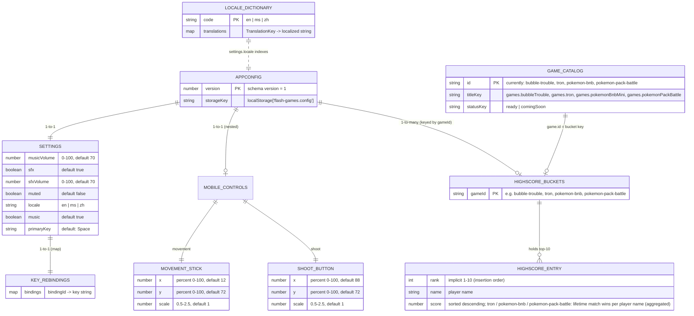

# Database Schema — Persisted Document Model

> **Note:** `react-flash-games` is a client-side React + Vite app with **no database engine**.
> The entire persisted data model is a single JSON document stored in `localStorage`
> under the key `flash-games.config`, seeded by the immutable bundled default
> (`src/config/default.config.json`) and accessed through `src/config/index.ts`.
> The ER diagram below is a **document-model mapping**, not relational SQL.

## Persisted schema (`AppConfig`)

```
AppConfig
├── version: number                                        (schema version, currently 1)
├── settings
│   ├── musicVolume: number                                (0–100, default 70)
│   ├── sfx: boolean                                       (default true)
│   ├── sfxVolume: number                                  (0–100, default 70)
│   ├── muted: boolean                                     (default false)
│   ├── locale: 'en' | 'ms' | 'zh'
│   ├── music: boolean
│   ├── primaryKey: string                                 (default "Space")
│   ├── keybindings: Record<string, string>                (e.g. bubble-shoot → ArrowUp, tron-p1-up → w, pokemon-confirm → Enter)
│   └── mobileControls
│       ├── movement: { x, y, scale }                      (percent pos + 0.5–2.5 scale)
│       └── shoot: { x, y, scale }
└── highscores: Record<gameId, { name, score }[]>          (top-10, sorted desc; tron + pokemon-bnb score = lifetime match wins per player name)
```

## ER diagram



> `GAME_CATALOG` and `LOCALE_DICTIONARY` are static/read-only source data (TS modules + JSON), not rows in storage — the dashed line signals that they conceptually "reference" the persisted document but live outside it.

## Source references

| Layer | Location | Role |
|---|---|---|
| **Schema seed** | `src/config/default.config.json` | Immutable defaults (`version`, `settings`, `highscores`) |
| **Persistence API** | `src/config/index.ts` | `readConfig()` / `writeConfig()` / `updateConfig()` + `mergeConfig()` deep-merge over defaults |
| **Persisted document** | `localStorage['flash-games.config']` | Single `AppConfig` record: settings + per-game highscores |
| **Static data** | `games/index.ts`, `assets/languages/*.json` | Game registry (read-only), en/ms/zh translation dictionaries |
| **Ephemeral state** | `BubbleTroubleGame.tsx`, `tron/TronGame.tsx`, `pokemon-bnb/PokemonBnbGame.tsx`, `pokemon-pack-battle/PokemonPackBattleGame.tsx` | Per-session runtimes + view state machines (never persisted); Tron adds session-only match options (rounds-to-win 1-9, per-player colors, per-player display names); Pokemon adds session-only lobby settings (set 30C, packs 1-6, prize cards 2-6, timer off/45/60/90s) that deliberately stay out of `AppConfig`; Pack Battle adds session-only lobby settings (set 30C, packs per player 1-18) that deliberately stay out of `AppConfig` |